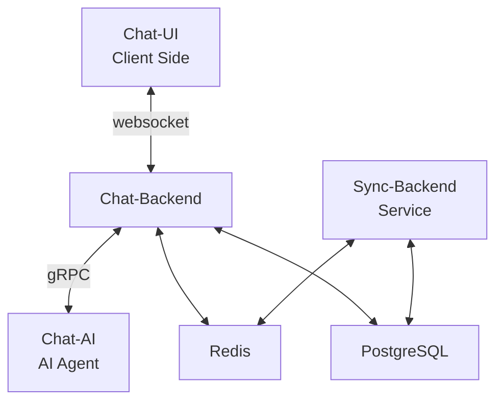

# 🤖 AI-at-Work


AI-at-Work is an organization dedicated to simplifying the development of AI agents through a comprehensive chat management system. Our suite of services provides developers with the tools they need to focus on implementing AI agents without getting bogged down in infrastructure management.

## 🚀 Our Vision

Streamlining AI agent development by tackling the complexities of:
- Chat session management
- Summary generation
- File handling
- Historical data retrieval

## 🛠️ Key Components

Our ecosystem consists of four powerful, interconnected services:

| Service | Description | Repository |
|---------|-------------|------------|
| 📡 **Chat-Backend** | Core service managing chat sessions | [Chat-Backend](https://github.com/AI-at-Work/Chat-Backend) |
| 🧠 **Chat-AI** | AI agent for processing inputs and generating responses | [Chat-AI](https://github.com/AI-at-Work/Chat-AI-Service) |
| 💻 **Chat-UI** | User-friendly client-side interface | [Chat-UI](https://github.com/AI-at-Work/Chat-UI) |
| 🔄 **Sync-Backend** | Ensures data consistency across storage systems | [Sync-Backend](https://github.com/AI-at-Work/Sync-Backend) |

## 🏗️ System Architecture



- **Redis**: Fast caching and real-time data access
- **PostgreSQL**: Robust persistent data storage
- **Websockets**: Seamless real-time client-server communication
- **gRPC**: Efficient Chat-Backend to Chat-AI communication

## ✨ Features

- 🤖 Automated chat session management
- 📊 Intelligent chat summary generation
- 📁 Seamless file handling capabilities
- 🕰️ Effortless retrieval of historical chat data
- ⚡ Real-time communication
- 📈 Scalable microservices architecture

## 🚀 Getting Started

1. Clone the repositories:
   ```bash
   git clone https://github.com/AI-at-Work/Chat-Backend.git
   git clone https://github.com/AI-at-Work/Chat-AI-Service.git
   git clone https://github.com/AI-at-Work/Chat-UI.git
   git clone https://github.com/AI-at-Work/Sync-Backend.git
   ```
2. Follow the setup instructions in each repository's README.

## 🤝 Contributing

We welcome contributions from the community! If you're interested in improving our services or adding new features, please check out our individual service repositories for contribution guidelines.

---

<p align="center">
  <i>Empowering the future of AI, one chat at a time.</i>
</p>


